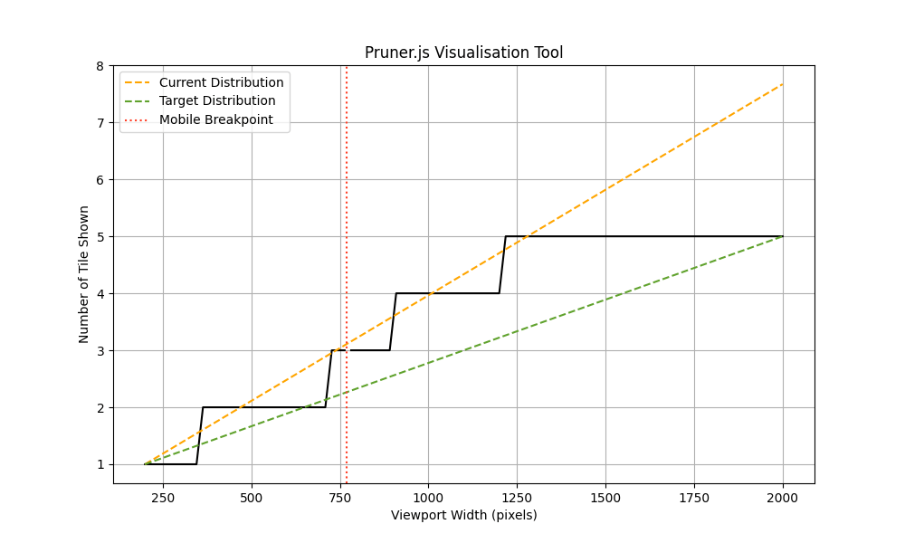

# pruner.js

[](https://www.npmjs.com/package/prunerjs)
[](https://www.npmtrends.com/prunerjs)
[](https://egghead.io/courses/how-to-contribute-to-an-open-source-project-on-github)

## Overview

**pruner.js** is a JavaScript utility for responsive images through viewport-based rendering. It works by splitting large images into smaller tiles and loading only the tiles needed for the current viewport. This method reduces the total data transferred and boosts performance by processing only the visible parts of the image. By cutting down on data usage and avoiding duplicate images often loaded with the traditional <picture> element.

## Install

You can include **`pruner.js`** in your project either by downloading the files or using a CDN.

### Download

- **Minified**: [Available via pruner.min.js on unpkg.](https://unpkg.com/prunerjs@1.0.4/dist/pruner.min.js)
- **Unminified**: [Available in the source repository.](/src/pruner.js)

### CDN

Link directly to the minified version using Unpkg (we recommend downloading the file to reduce HTTP requests):

```html
<script async src="https://unpkg.com/prunerjs@1.0.4/dist/pruner.min.js"></script>
```

### Package Managers

You can also install **`pruner.js`** using npm:

```bash
npm install pruner --save
```

## How It Works

### Image and Attribute Requirements

1. **Attribute (`data-pruner`)**
  - **Purpose**: This attribute holds the configuration for each image element in JSON format.
  - **Parameters**:
    - `imageName`: The base name of the images used in conjunction with the image (string).
    - `cols`: Number of columns (integer).
    - `rows`: Number of rows (integer).
    - `tileWidth`: Width of each tile in pixels (integer).
    - `tileHeight`: Height of each tile in pixels (integer).
    - `mobileBreakpoint`: The screen width in pixels below which the mobile image is loaded (integer).
    - `mobileScale`: Scale factor for mobile view (optional, numeric).
    - `imagePath`: Path to the directory where images are stored (string).

2. **Images**
  - **Name**: Ensure that `imageName` matches the base name used for the pruner tile images. For instance, if `imageName` is `landscape`, the images should be named `landscape 1.webp`, `landscape 2.webp`, and so on.
  - **File**: All image formats are supported; however, using a modern image format like WebP is recommended for further optimisation.
  - **Making Tiles**: For processing images into tiles, consider using a free online tool such as [Split Image](https://pinetools.com/split-image) or using the [Slice tool](https://helpx.adobe.com/content/help/uk/en/photoshop/using/slicing-web-pages.html) within Adobe Photoshop.

## Initialize

You can initialize **`pruner.js`** using vanilla JavaScript or by setting attributes in your HTML.

### With Vanilla JavaScript

```javascript
window.onload = () => {
  new Pruner('data-pruner');
};
```

### Example HTML Setup

You can use the `data-pruner` attribute to configure how the image is processed.

```html

```

- **Attribute**: `data-pruner`
  - `imageName`: `landscape`
  - `cols`: `5` (5 columns)
  - `rows`: `5` (5 rows)
  - `tileWidth`: `300` (pixels)
  - `tileHeight`: `200` (pixels)
  - `mobileBreakpoint`: `768` (pixels)
  - `mobileScale`: `1.4` (140%)
  - `imagePath`: `/assets/` (path to images)

### Usage

1. **Include `pruner.js`** in your HTML file:
   ```html
   <script src="path/to/pruner.js"></script>
   ```

2. **Set Up Images**:
   - Ensure that `imageName` matches the base name used for the pruner tile images. For instance, if `imageName` is `landscape`, the images should be named `landscape 1.webp`, `landscape 2.webp`, and so on.
   - Add the `data-pruner` attributes to the image, specifying the name of the image, the number of columns, rows, tile width, tile height, mobile breakpoint, mobile scale factor, and image path.

### Mobile Optimization

On mobile devices (below the `mobileBreakpoint`), only the central tiles of the grid are loaded for improved performance. This is determined by the `mobileScale` parameter, which adjusts the scaling of the tiles based on the device’s screen size. For larger screens, the entire tiled image grid is constructed and displayed on a canvas.

## Performance

### Methodology

To evaluate the performance improvements from using **`pruner.js`** compared to loading two full images for desktop and mobile, tests were conducted using the [Example HTML Setup](#example-html-setup). The test image (1500 x 1000px) was split into a 5x5 grid, with each tile measuring 300 x 200px. All image assets are available in the [`/assets`](/assets) folder. The original image was sourced from [T. Keller on Unsplash](https://unsplash.com/photos/landscape-photography-of-lake-and-mountain-73F4pKoUkM0).

#### Example HTML Setup Test

This experiment compared two approaches to image loading:

- **Using [Srcset](https://developer.mozilla.org/en-US/docs/Web/API/HTMLImageElement/srcset)**: Loading two images using the 1500 x 1000px for desktop and 500 x 1000px for mobile.
- **Using `pruner.js`**: Loading 25 tiles (300 x 200px) plus the 2 KB minified script.

To ensure consistent and accurate results, the following factors were considered:

- Google Chrome DevTools was used to standardise viewport sizes for all tests.
- The viewport height was set to 750px, simulating a typical 'banner' image.
- CO₂e emissions were estimated using the [EcoPing 'Convert Bytes to CO2 grams' calculator](https://ecoping.earth/tools/convert-bytes-to-co2-grams/), with the Device Country and Data Centre set to the United States. These estimates provide an approximation, based on the [Sustainable Web Design Model](https://sustainablewebdesign.org/estimating-digital-emissions/).

To Note:

- The number of visible tiles varied based on viewport size and device.
- Data savings vary depending on the image's detail and compression; less detailed or more compressed tiles resulted in greater optimisation.
- JPEG format was used in the test, though WebP or other modern formats are recommended for additional savings.

##### Objectives

1. Measure the number of visible tiles when using **`pruner.js`** across different viewport sizes (mobile, medium desktop, large desktop).
2. Compare the total data transferred before and after implementing **`pruner.js`** across each viewport size.
3. Evaluate the total file size reduction by comparing the conventional approach of using separate images for different viewport sizes with the tile-based approach using **`pruner.js`**, including the size of the minified script itself.
4. Estimate CO₂ emissions before and after optimisation.

### Results

|                         | 📱 Small 650px          | 💻 Medium 1100px         | 🖥️ Large 1680px         | 📁 All Assets           |
|-------------------------|-------------------------|-------------------------|-------------------------|-------------------------|
| Before                  |                         |                         |                         |                         |
| **📁 Size** (KB)        | 50 KB                   | 194 KB                  | 194 KB                  | 244 KB (2 Images)       |
| **🌱 CO₂e** (g)         | 0.013 g                 | 0.053 g                 | 0.053 g                 | 0.067 g                 |
| After                   |                         |                         |                         |                         |
| **🧩 Tiles**            | 6                       | 16                      | 20                      | 25                      |
| **📁 Size** (KB)        | 26 KB                   | 83 KB                   | 105 KB                  | 156 KB                  |
| **🌱 CO₂e** (g)         | 0.007 g                 | 0.022 g                 | 0.029 g                 | 0.043 g                 |
| Savings                 |                         |                         |                         |                         |
| **📁 ∆ Size** (KB)      | -24 KB                  | -111 KB                 | -89 KB                  | -88 KB                  |
| **🌱 ∆ CO₂e** (g)       | -0.006 g                | -0.031 g                | -0.024 g                | -0.024 g                |
| **✂️ Reduction** (%)     | **46 %**                | **57.1 %**              | **45.4 %**              | **36.1 %**              |

*Ongoing testing is being conducted to expand the sample size and further verify the results.*

## Visualisation



There is also a Python visualisation tool designed to determine the optimal combination of tile count, row height, and tile size, and mobile scaling. This tool ensures efficient asset usage and performance across various common viewport dimensions.

For more information on installation and usage instructions, please refer to [this document](/visualisation/README.md).  
The application can also be found in [this directory](/visualisation/).

## License

**`pruner.js`** is released under the [MIT](/LICENSE) license. Feel free to use and modify it as needed.